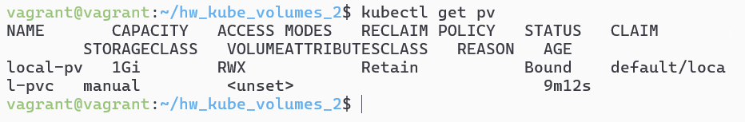
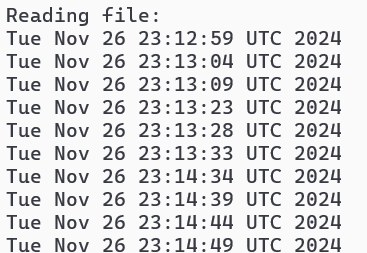
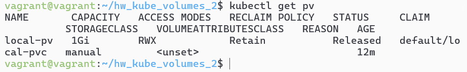
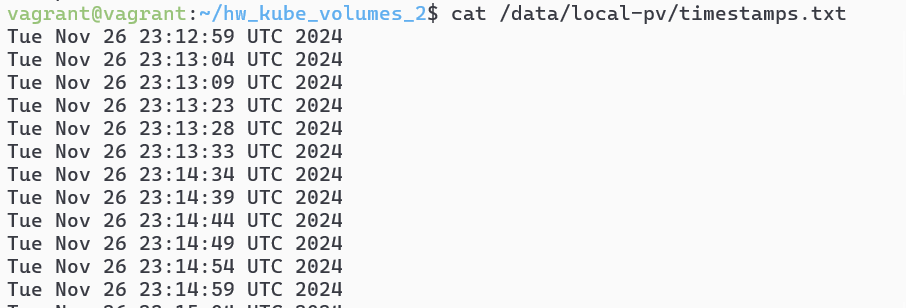
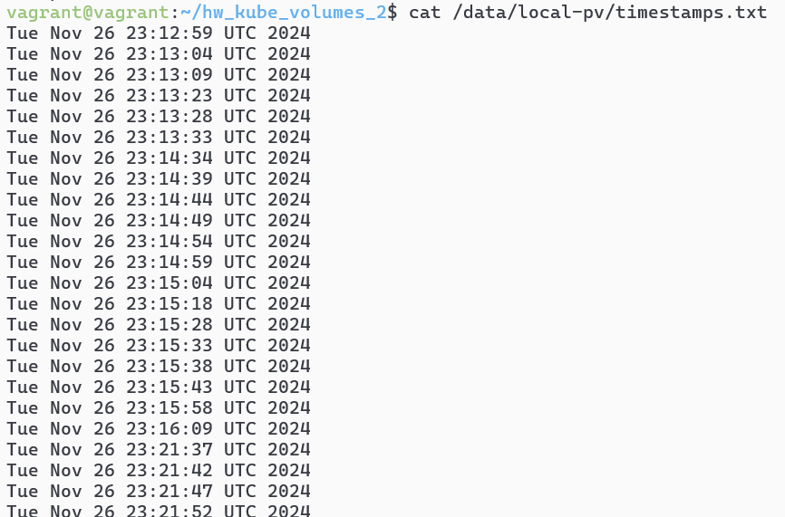
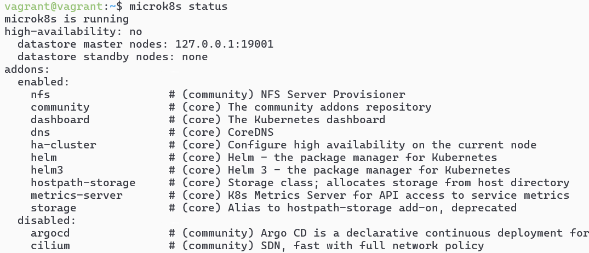
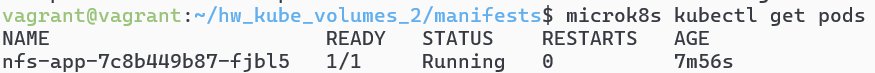
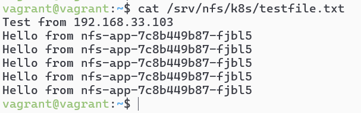

# Домашнее задание к занятию «Хранение в K8s. Часть 2»- Михалёв Сергей

### Цель задания

В тестовой среде Kubernetes нужно создать PV и продемострировать запись и хранение файлов.

------

### Дополнительные материалы для выполнения задания

1. [Инструкция по установке NFS в MicroK8S](https://microk8s.io/docs/nfs). 
2. [Описание Persistent Volumes](https://kubernetes.io/docs/concepts/storage/persistent-volumes/). 
3. [Описание динамического провижининга](https://kubernetes.io/docs/concepts/storage/dynamic-provisioning/). 
4. [Описание Multitool](https://github.com/wbitt/Network-MultiTool).

------

### Задание 1

**Что нужно сделать**

Создать Deployment приложения, использующего локальный PV, созданный вручную.

1. Создать Deployment приложения, состоящего из контейнеров busybox и multitool.
2. Создать PV и PVC для подключения папки на локальной ноде, которая будет использована в поде.
3. Продемонстрировать, что multitool может читать файл, в который busybox пишет каждые пять секунд в общей директории. 
4. Удалить Deployment и PVC. Продемонстрировать, что после этого произошло с PV. Пояснить, почему.
5. Продемонстрировать, что файл сохранился на локальном диске ноды. Удалить PV.  Продемонстрировать что произошло с файлом после удаления PV. Пояснить, почему.
5. Предоставить манифесты, а также скриншоты или вывод необходимых команд.

------

**Решение**

Создал Deployment приложение [deployment.yaml](manifests/deployment.yaml), состоящего из контейнеров busybox и multitool.

Создал [pv.yaml](manifests/pv.yaml) и [pvc.yaml](manifests/pvc.yaml) для подключения папки на локальной ноде, которая будет использована в поде.

Состояние pv

 

Демонстрация, что multitool может читать файл, в который busybox пишет каждые пять секунд в общей директории.

 

Удалил Deployment и PVC. Состояние pv на скриншоте ниже.  PV перешёл в состояние Released, потому что PVC было удалено, но данные в PV остались (политика Retain).

Демонтсрация, что файл сохранился на локальном диске ноды.

После удаления файл остаётся на диске, так как Kubernetes не удаляет данные автоматически при удалении PV (политика Retain).

------

### Задание 2

**Что нужно сделать**

Создать Deployment приложения, которое может хранить файлы на NFS с динамическим созданием PV.

1. Включить и настроить NFS-сервер на MicroK8S.
2. Создать Deployment приложения состоящего из multitool, и подключить к нему PV, созданный автоматически на сервере NFS.
3. Продемонстрировать возможность чтения и записи файла изнутри пода. 
4. Предоставить манифесты, а также скриншоты или вывод необходимых команд.

------

**Решение**

Для работы поднял две виртуальные машины с адресами:
- NFS-сервер: 192.168.33.102
- Deployment: 192.168.33.103

Включил и настроить NFS-сервер на MicroK8S.

Создал Deployment приложения [deployment-nfs.yaml](manifests/deployment-nfs.yaml), и подключил к нему [pvc-nfc.yaml](manifests/pvc-nfc.yaml), созданный автоматически на сервере NFS [nfs-storageclass.yaml](manifests/nfs-storageclass.yaml).

Получил список нодов

Проверил полученные сообщения на NFS-сервере

-----

